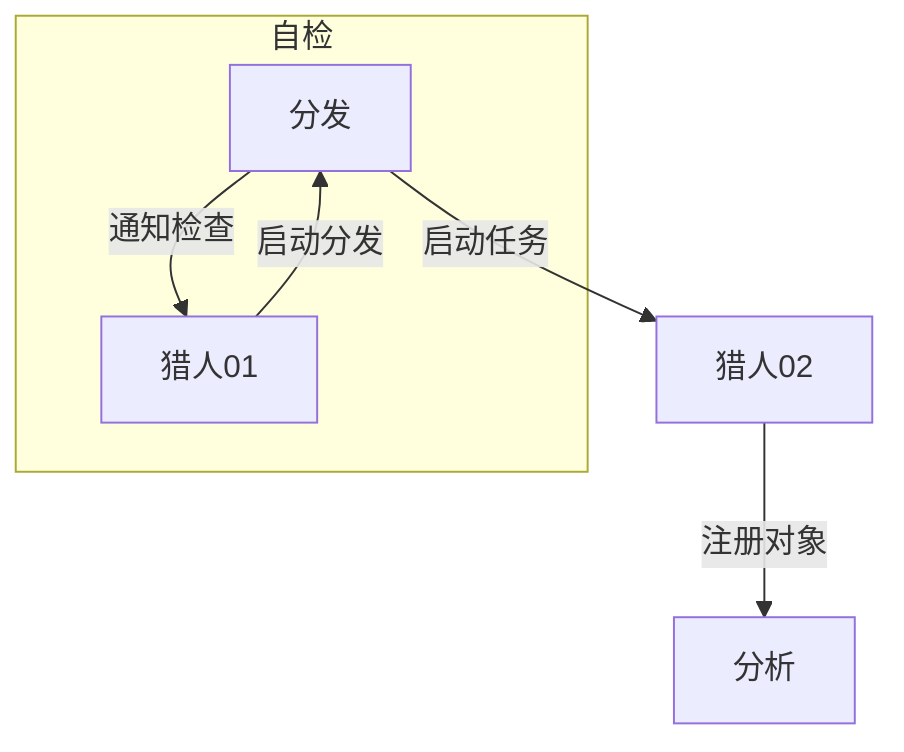

# 流程设计

## 描述  
**猎人01**
读取设定，开始启动任务寻找。以对应{返回对象}
**猎人02**
爬取对象信息{返回对象}
**分发中心**
自检{接收对象，返回布尔值}（启动 01），插入任务队列，接收任务以及分拨任务对象（专栏或视频）。{接收对象，发送对象}
**数据中心**
接收日志信息，提供数据比对与任务队列功能
**分析中心**
分析上级对象，生成报告，存储档案（以个人为对象）
分析本身对象，生成成分报告，存储档案

####  
分发中心自检数据

## 待定
可以补充
——yaml
- 发言次数
13
- 发言视频
BV114541
- 发言内容统计
按照赞数排序（复用）

- TAG分析
按照频率排行（复用）

- 词汇云分析
词汇

- 敏感信息抓录
邮箱匹配与url,qq,weixin 正则

按个人uid为档案存储
按bid档案存储

